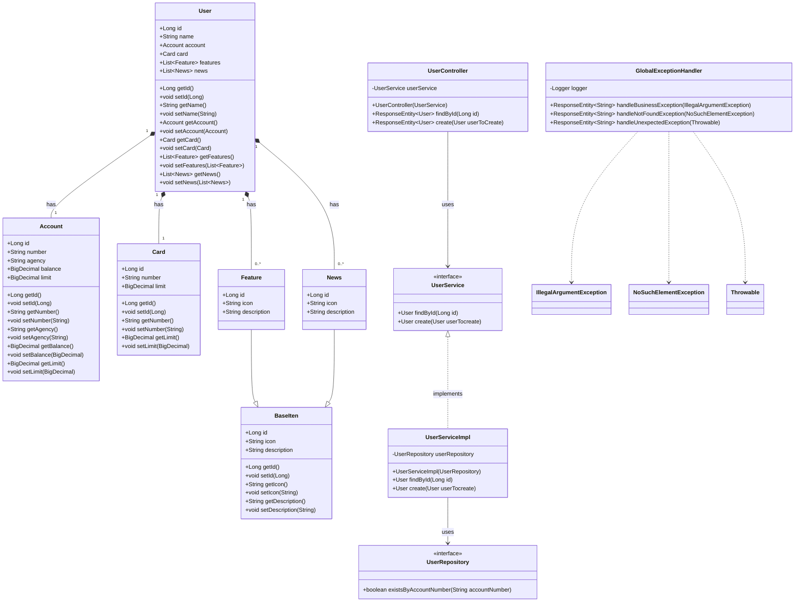
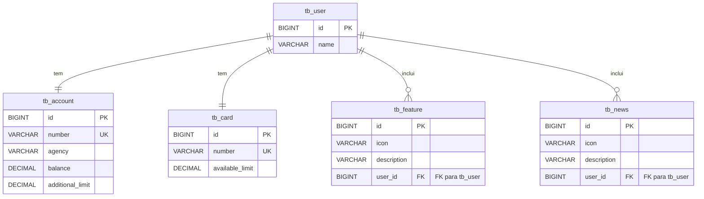

# HomeBankAPI

API RESTful em Java Spring Boot para gerenciar informações de usuários de um aplicativo bancário. Esta API fornece funcionalidades para criar e consultar usuários, incluindo seus dados de conta, cartão, recursos e notícias associadas.

## ✨ Funcionalidades

*   **Cadastro de Usuários**: Cria novos usuários com suas contas, cartões, funcionalidades e notícias associadas.
*   **Consulta de Usuários**: Busca detalhes de usuários específicos pelo ID.
*   **Validação de Negócio**: Impede a criação de usuários com número de conta duplicado.
*   **Tratamento Global de Exceções**: Lida de forma centralizada com erros de negócio (`422 Unprocessable Entity`), recursos não encontrados (`404 Not Found`) e erros inesperados do servidor (`500 Internal Server Error`).
*   **Persistência de Dados**: Utiliza Spring Data JPA para interagir com o banco de dados.
*   **Documentação de API**: Gerada automaticamente com SpringDoc OpenAPI (Swagger UI) para facilitar o consumo da API.
*   **Perfis de Banco de Dados**: Suporte para H2 (desenvolvimento) e PostgreSQL (produção).

## 🚀 Tecnologias Utilizadas

*   **Java 17**
*   **Spring Boot 3.x**
*   **Spring Data JPA**
*   **Spring Web**
*   **H2 Database**: Para desenvolvimento e testes locais.
*   **PostgreSQL**: Para ambientes de produção.
*   **Maven**: Gerenciador de dependências e build do projeto.
*   **SpringDoc OpenAPI**: Para documentação da API (Swagger UI).
*   **SLF4J/Logback**: Para logging.

## ⚙️ Como Começar

Siga estas instruções para configurar e executar o projeto localmente.

### Pré-requisitos

*   Java Development Kit (JDK) 17 ou superior
*   Apache Maven
*   (Opcional para ambiente de produção) PostgreSQL instalado e configurado.

### Instalação

1.  Clone o repositório para sua máquina local:
    ```bash
    git clone https://github.com/XandersonSilva/HomeBankAPI.git
    cd HomeBankAPI
    ```

2.  Construa o projeto usando Maven:
    ```bash
    mvn clean install
    ```
    Após o build, o arquivo JAR executável estará disponível em `target/HomeBankAPI-3.5.0.jar`.

### Execução

Você pode executar a aplicação usando o perfil de desenvolvimento (H2) ou o perfil de produção (PostgreSQL).

#### Modo de Desenvolvimento (H2 Database)

Este modo usa o banco de dados H2 em memória, ideal para desenvolvimento e testes rápidos.

```bash
mvn spring-boot:run
```

A API estará disponível em `http://localhost:8080`.
Executando no perfil dev o console do H2 estará disponível em `http://localhost:8080/h2-console` (JDBC URL: `jdbc:h2:mem:xnd2025`, Usuário: `xnd2025`, Senha: ` `).

#### Modo de Produção (PostgreSQL)

Para rodar em produção, certifique-se de que o PostgreSQL esteja configurado e acessível. Você precisará definir as variáveis de ambiente para a conexão com o banco de dados.

```bash
# Exemplo de configuração de variáveis de ambiente (Linux/macOS) e executando a aplicação com o perfil 'prod'
export PGHOST=localhost
export PGPORT=porta_do_banco
export PGDATABASE=nome_do_seu_banco # Ex: homebankdb
export PGUSER=seu_usuario
export PGPASSWORD=sua_senha

```

### Documentação da API (Swagger UI)

Após iniciar a aplicação localmente, você pode acessar a documentação interativa da API via Swagger UI em:
`http://localhost:8080/swagger-ui.html`

## 🚀 Deploy

A aplicação está deployada e disponível publicamente em:
**`https://homebankapi.up.railway.app/`**

Você pode acessar a documentação Swagger UI da aplicação deployada em:
`https://homebankapi.up.railway.app/swagger-ui.html`

## 📊 Endpoints da API

A base da URL para os endpoints é `http://localhost:8080` para execução local e `https://homebankapi.up.railway.app` para a aplicação deployada.

### `GET /users/{id}`

*   **Descrição**: Retorna os detalhes de um usuário específico pelo seu ID.
*   **Parâmetros de Path**:
    *   `id` (Long, obrigatório): O ID do usuário.
*   **Exemplo de Resposta (200 OK)**:
    ```json
    {
      "name": "João da Silva",
      "account": {
        "number": "12345-6",
        "agency": "0001",
        "balance": 1500.00,
        "limit": 500.00
      },
      "card": {
        "number": "1111222233334444",
        "limit": 2000.00
      },
      "features": [
        {
          "icon": "icon_transfer",
          "description": "Transferências"
        },
        {
          "icon": "icon_payment",
          "description": "Pagamentos"
        }
      ],
      "news": [
        {
          "icon": "icon_promo",
          "description": "Promoções Exclusivas"
        }
      ]
    }
    ```
*   **Respostas de Erro**:
    *   `404 Not Found`: Se o ID do usuário não for encontrado (`Resource ID not found`).

### `POST /users`

*   **Descrição**: Cria um novo usuário no sistema.
*   **Corpo da Requisição (JSON)**:
    ```json
    {
      "name": "Maria Oliveira",
      "account": {
        "number": "78901-2",
        "agency": "0002",
        "balance": 2000.00,
        "limit": 1000.00
      },
      "card": {
        "number": "5555666677778888",
        "limit": 3000.00
      },
      "features": [
        {
          "icon": "icon_invest",
          "description": "Investimentos"
        }
      ],
      "news": [
        {
          "icon": "icon_tip",
          "description": "Dicas Financeiras"
        }
      ]
    }
    ```
*   **Exemplo de Resposta (201 Created)**: Retorna o objeto `User` criado e um cabeçalho `Location` com a URI do novo recurso.
    ```json
    {
      "id": 2, # ID gerado automaticamente
      "name": "Maria Oliveira",
      ... (demais dados do usuário)
    }
    ```
*   **Respostas de Erro**:
    *   `422 Unprocessable Entity`: Se o número da conta já existir (`This User Account Number already exists.`).
    *   `500 Internal Server Error`: Para erros inesperados do servidor (`Unexpected server error`).

## ⚠️ Tratamento de Erros

A API possui um tratamento global de exceções para fornecer respostas claras em caso de erros:

*   **`IllegalArgumentException`**: Retorna `422 Unprocessable Entity` com a mensagem de erro de negócio (ex: `This User Account Number already exists.`).
*   **`NoSuchElementException`**: Retorna `404 Not Found` com a mensagem `Resource ID not found` quando um recurso solicitado por ID não é encontrado.
*   **`Throwable` (genérico)**: Retorna `500 Internal Server Error` com a mensagem `Unexpected server error` para qualquer outra exceção não tratada, registrando detalhes no log do servidor.

## 📝 Diagramas

Aqui estão os diagramas de classes e relacionais do projeto, fornecendo uma visão geral da estrutura e do esquema do banco de dados.

### Diagrama de Classes

Este diagrama representa as classes do domínio e suas relações, incluindo herança e associações.



### Diagrama Relacional (Esquema do Banco de Dados)

Este diagrama mostra as tabelas e seus relacionamentos no banco de dados.




## Licença

Distribuído sob a [MIT License](LICENSE).

## Contato

- **Autor**: Xanderson Silva  
- **Email**: xandersonsilvasouza@gmail.com  
- **LinkedIn**: [Perfil LinkedIn](https://www.linkedin.com/in/xanderson-silva)

**Contribuições são bem-vindas!** Sinta-se à vontade para abrir issues ou pull requests.
